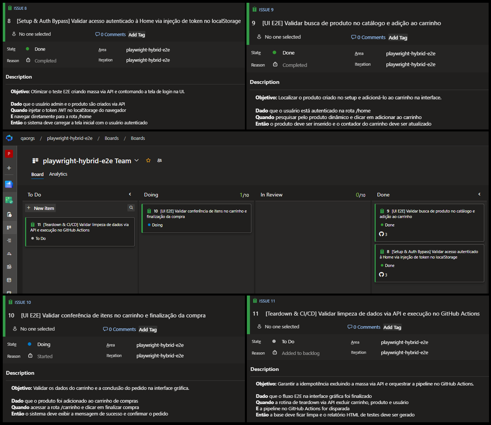

# Playwright Hybrid E2E - Automação Híbrida de Testes (API + UI + CI/CD)

Projeto de automação de testes **End-to-End Híbrido (API + UI)** na aplicação **ServeRest**, construído com **Playwright** e **TypeScript**, unindo a velocidade e o isolamento do provisionamento de massa via **API REST** com a validação visual da jornada crítica do usuário na **Interface Gráfica (UI)**, com gestão ágil no **Azure DevOps (Boards)** e esteira de integração contínua automatizada no **GitHub Actions**.

## Objetivo

Orquestrar uma jornada de testes moderna, atômica e idempotente. Em vez de depender de scripts lentos que realizam cadastros e logins repetitivos pela interface gráfica ou depender de massa de dados estática que pode ser corrompida por outros testes, a arquitetura híbrida:
1. **Provisiona dados exclusivos via API** em milissegundos (usuários e produtos com estoque).
2. **Executa o bypass de autenticação** injetando a sessão JWT diretamente no `localStorage` do navegador, pulando a tela de login.
3. **Valida a jornada crítica na UI** (catálogo, carrinho e checkout na interface visual).
4. **Executa o teardown completo via API** ao término do ciclo, deletando toda a massa residual e mantendo a base limpa.

## Tecnologias e Ferramentas

- **Playwright** (`@playwright/test` - Automação Web & `APIRequestContext`)
- **TypeScript** & **Node.js**
- **Azure DevOps (Boards)** (Planejamento ágil, Kanban e rastreabilidade com Work Items `AB#ID`)
- **GitHub Actions** (Pipeline de CI/CD para execução contínua em nuvem no Ubuntu com relatórios HTML)
- **Git / GitHub** (Controle de versão com branches por feature, Pull Requests e checks automatizados)

## Gestão Ágil e Rastreabilidade (Azure DevOps + GitHub)

O planejamento dos épicos, especificação dos cenários em BDD/Gherkin e ciclo de vida de desenvolvimento e entrega foram gerenciados no **Azure DevOps (Boards)** integrado ao repositório no **GitHub**:

- **Rastreabilidade por Work Item:** Cada branch e Pull Request faz referência direta ao ID do card no Azure DevOps:
  - `feat/AB#8-setup-auth-bypass`
  - `feat/AB#9-add-to-cart`
  - `feat/AB#10-checkout-flow`
  - `feat/AB#11-teardown-cicd`
- **Vinculação e Fechamento:** Commits e Pull Requests associados diretamente à aba *Development* dos Work Items através de menções e tags de fechamento (`Fixes AB#ID`).
- **Workflow Kanban:** Gestão visual do fluxo de trabalho pelas etapas `To Do` ➔ `Doing` ➔ `In Review` ➔ `Done`.

### Quadro Kanban e Detalhamento dos Cards no Azure DevOps



## Arquitetura da Jornada Híbrida E2E (`tests/hybrid-flow.spec.ts`)

A suíte foi modelada como uma jornada sequencial orquestrada utilizando `test.describe.serial`, permitindo o compartilhamento seguro de contexto (`productName`, `productId`, `clientToken`, `adminToken`) entre os passos:

### 1. Setup Dinâmico de Massa e Auth Bypass (`AB#8`)
* **API Setup (Admin & Produto):** Criação de usuário administrador dinâmico via `POST /usuarios`, autenticação via `POST /login` e cadastro de um produto exclusivo com estoque via `POST /produtos`.
* **API Setup (Cliente Comum):** Criação de usuário cliente comum via `POST /usuarios` e autenticação para captura do Bearer Token.
* **UI Auth Bypass:** Injeção da chave `serverest/userToken` no `localStorage` do navegador via `page.addInitScript()` antes da renderização da página.
* **Validação:** Acesso direto a `https://front.serverest.dev/home` já autenticado, sem passar pela tela de login na UI.

### 2. Busca no Catálogo e Adição ao Carrinho (`AB#9`)
* **UI Navigation:** Abertura da loja autenticada com a sessão do cliente provisionado.
* **Dynamic Search:** Localização do card do produto exclusivo gerado via API através do seletor semântico `page.locator('.card').filter({ hasText: productName })`.
* **Add to Cart:** Ação de inclusão do produto na lista de compras (`adicionarNaLista`).
* **Validação:** Redirecionamento para `/minhaListaDeProdutos` e conferência do nome do produto e quantidade (`Total: 1`).

### 3. Conferência de Itens e Checkout na Interface (`AB#10`)
* **Cart Verification:** Validação da persistência e cálculo dos itens adicionados na tabela da lista de compras.
* **Checkout Action:** Clique no botão de fechamento de pedido (`Adicionar no carrinho`).
* **UI State Assertion:** Tratamento e validação da resposta visual da tela do ServeRest (`"Em construção aguarde"`), garantindo a estabilidade da experiência do usuário sem falhas de execução.

### 4. Teardown Idempotente via API (`AB#11`)
* **API Cart Cleanup:** Cancelamento de compras ativas via `DELETE /carrinhos/cancelar-compra` utilizando o token do cliente.
* **API Product Deletion:** Exclusão do produto criado via `DELETE /produtos/{id}` utilizando o token do administrador.
* **API Users Deletion:** Exclusão do usuário cliente e do usuário admin via `DELETE /usuarios/{id}`.
* **Idempotência Garantida:** Eliminação de 100% da massa gerada, permitindo infinitas execuções sem acúmulo de dados residuais ou erros de duplicidade.

## Pipeline de CI/CD (GitHub Actions)

A esteira de integração contínua automatizada está configurada em [`.github/workflows/playwright.yml`](./.github/workflows/playwright.yml):

- **Gatilhos de Execução:** Disparada automaticamente a cada `push` e `pull_request` direcionados à branch `main`.
- **Ambiente de Execução:** Runner Linux (`ubuntu-latest`) com provisionamento limpo de Node.js, instalação estrita de dependências (`npm ci`) e instalação dos navegadores do Playwright (`playwright install --with-deps`).
- **Execução Headless da Suíte:** Execução automatizada de todos os testes da suíte híbrida.
- **Artefatos e Evidências:** Geração e upload automático do relatório HTML do Playwright (`playwright-report`) disponível para download por 30 dias.

## Destaques Técnicos de Arquitetura

- **Otimização Extrema de Performance:** O bypass de autenticação via injeção no `localStorage` elimina dezenas de segundos de interação visual repetitiva com formulários de login.
- **Isolamento de Massa e Idempotência:** Uso do gerador sequencial [counter.json](./counter.json) somado ao teardown via API, garantindo zero dependência de banco de dados pré-existente.
- **Orquestração Linear com `test.describe.serial`:** Execução sequencial estrita mantendo clareza de escopo e variáveis compartilhadas (`let`).
- **Suporte Multi-Browser:** Suíte homologada para execução paralela em Chromium, Firefox e WebKit.

## Estrutura do Repositório

```text
├── .github/
│   └── workflows/
│       └── playwright.yml            # Pipeline de CI/CD no GitHub Actions
├── docs/
│   └── assets/
│       └── print-azure-details.png   # Evidência do Azure DevOps Boards e Cards
├── tests/
│   └── hybrid-flow.spec.ts           # Suíte E2E Híbrida completa (AB#8 a AB#11)
├── counter.json                      # Contador incremental de massa de dados
├── playwright.config.ts              # Configuração global de execução do Playwright
├── tsconfig.json                     # Configuração do compilador TypeScript
├── package.json                      # Manifesto de dependências e scripts Node.js
└── README.md                         # Documentação oficial do projeto
```

## Como Executar os Testes

1. **Clonar o repositório:**
   ```bash
   git clone git@github.com:giovanemedeiros/playwright-hybrid-e2e.git
   cd playwright-hybrid-e2e
   ```

2. **Instalar as dependências:**
   ```bash
   npm install
   ```

3. **Executar a suíte completa (Modo Headless):**
   ```bash
   npx playwright test
   ```

4. **Executar com interface gráfica no Chromium:**
   ```bash
   npx playwright test --project=chromium --headed
   ```

5. **Visualizar o relatório detalhado em HTML:**
   ```bash
   npx playwright show-report
   ```
